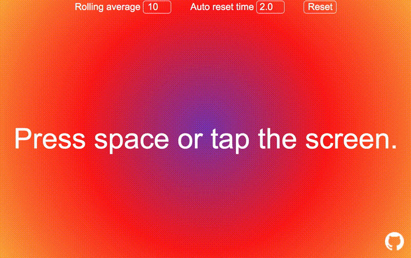

# BPM Tapper 
A website where you can determine the BPM by tapping/clicking the screen or by pressing space. 

Check it out [here](https://sebastiangrans.github.io/BPM-Tapper/)! 

**Note:** Not yet optimized for phones. 

# Screen capture 

# Ideas 
## Animated charts 
One could add a dynamic line chart at the bottom displaying BPM vs time. 

Similar to [this](https://www.grapecity.com/wijmo/demos/Chart/LineArea/DynamicLineChart/vue) example! Although, I'd prefer a continously growing x-axis to make it appear smoother. 
